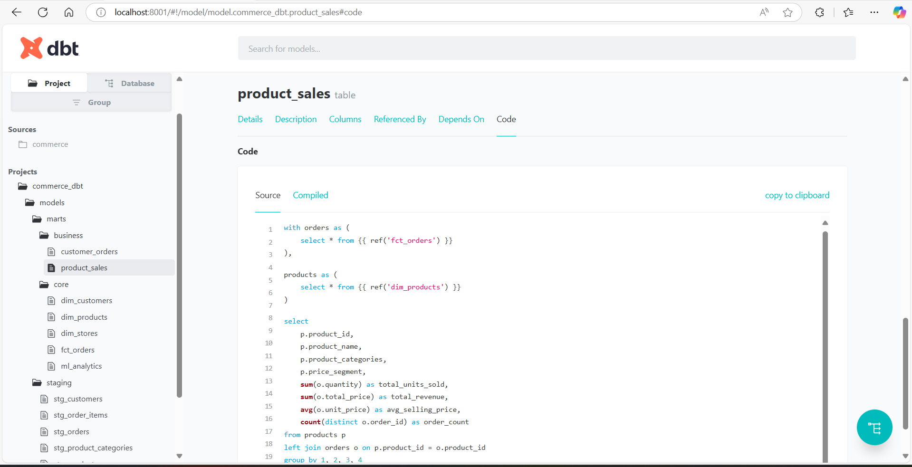

# Sales Analysis - ML Prediction

This is a complete end-to-end project, which implements ETL Pipelines, makes analysis & Dashboards, and then builds a Prediction Model for the Sales Analysis dataset. The dataset contains 6 CSV files: 
- `customers.csv`, 
- `order_items.csv`, 
- `orders.csv`
- `product_categories.csv`, 
- `products.csv`, 
- `stores.csv`

## System Architecture

<!--  -->
## Entity Relationship: Data Modelling


## 🔧 What is covered in this project?
- **ELT using Apache Airflow and DBT Tool**: Automating ELT process.
- **Connecting to other Data & Business Analysis Tools**: Connecting Apache Airflow to PostgreSQL and PostgreSQL to PowerBI.
- **Time Series Prediction**: Different Machine Learning Models and an ARIMA Model were built for sales prediction, and the best model, LightGBM, has been selected.
- **FastAPI Deployment**: The recommendation system was deployed using FastAPI.
- **Docker Support**: Created a Dockerfile for easy deployment..

## How to run the Application

### Apache Airflow: Data Engineering Part

1. **Initiate Apache Airflow**:

    ```bash
    docker compose up airflow-init
    docker compose up
    ```

2. **Connecting to external Analysis Tools**:

    Now you can go to http://localhost:8080/home on your browser to access Apache Airflow.
    You must also connect Apache Airflow to SQL (any Relational SQL databases - in this case, Dbeawer is used) and SQL to PowerBI.

    Please note, to generate dbt docs - documentation, use a different port than 8080. This is because airflow-webserver uses it. You could use, for example, 8081.
    dbt_docs_generation DAG on Apache Airflow is for dbt doc generation only. You could access it with the code below

    ```bash
    dbt docs serve --port 8081
    ```

### FastAPI: Deployment Part

1. **Build the Docker image**:

    ```bash
    docker build -t sales_project .
    docker run -p 8000:8000 sales_project
    ```

    This will expose the FastAPI app on `http://127.0.0.1:8000`.

2. **Access the application**:
    - **FastAPI Docs**: You can access the auto-generated documentation and interact with the FastAPI at `http://localhost:8000/docs#/default`.

## Available API Functions

The API exposes the main function - weekly prediction, which is also accessible through the FastAPI Web User Interface:

**weekly_predictions**: This returns a weekly prediction for a specific product. Please look at the available product names below or in the products.csv file:
- iPhone
- Samsung
- Xiaomi
- HP
- MacBook
- Acer
- Dell
- Toaster
- Electric Kettle
- Mixer
- Microwave Oven
- Coffee Maker
- Refrigerator
- Stove
- Range Hood
- Dish Washer

## Project Structure

```bash
sales_analysis/
│
├── Dockerfile          
├── requirements.txt         
├── README.md
├── powerbi_commerce.pdf
├── powerbi_commerce.pbix
├── flowchart.pdf
│
├── airflow/
│── ── docker-compose.yaml
│── ── dags/
│── ── ../
│
├── commerce_dbt/
│── ── user.yml
│── ── dbt_project.yml
│── ── profiles.yml
│── ── models/
│── ── ── marts/
│── ── ── ── business/
│── ── ── ── core/
│── ── ── staging/
│── ── ../
│
├── dataset/
│── ── initial_dataset/
│── ── new_dataset/
│
├── model/
│── ── ml_analytics_202504181528.csv # saved from sql - from Database
│── ── mae_ml_model.csv
│── ── machine_learning.ipynb
│── ── products_df/
│
├── server/
│── ── server_models/
├── requirements.txt
├── server_api.py
├── server_util_functions.py
├── server_utils.py
│
├── temp/
│── ── ../
│
```

## Project Screenshots

### Apache Airflow - ETL


### DBT Tool Documentation


### Power BI


### MLFlow


### Machine Learning Statistics


### Postman API Testing - Post Method


